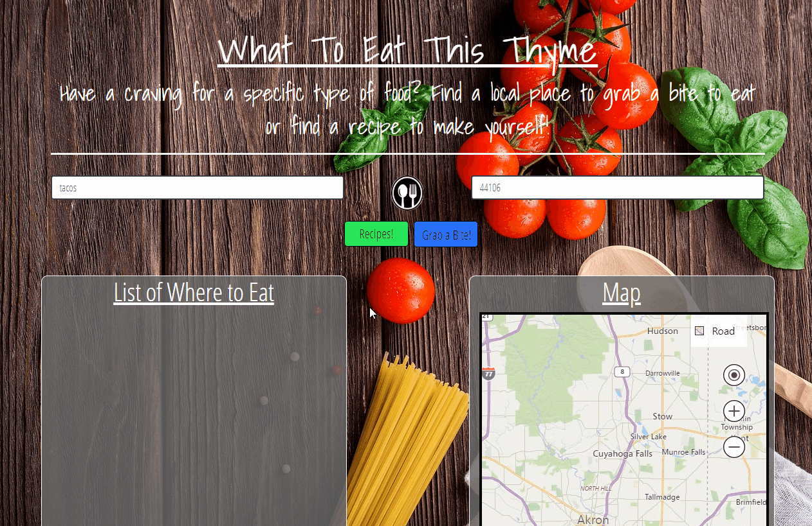

# What to Eat This Thyme

[Link to Application](https://theluomamr.github.io/Group_Project_One/)

[Link to Presentation](https://docs.google.com/presentation/d/10GidIY9vXRCTgutkqgzd7ZGQ71gpl1meLKrzziF9aRc/edit?usp=sharing)

### A multi-purpose application allowing users to locate places to eat or instead, discover a new recipe to make at home.

## Technologies Used
Javascript, JQuery, HTML, CSS, Bootstrap, APIs (Bing, Yelp, Edamam)

## App Description
User inputs food they want to eat and their location to display a list of restaurants with map locations or a list of recipes

## *Enter a food and a location zip code*

## *Click "Grab a Bite!" to show restaurant and map results*

## *Click "Recipes!" to show a list of recipes with links*
